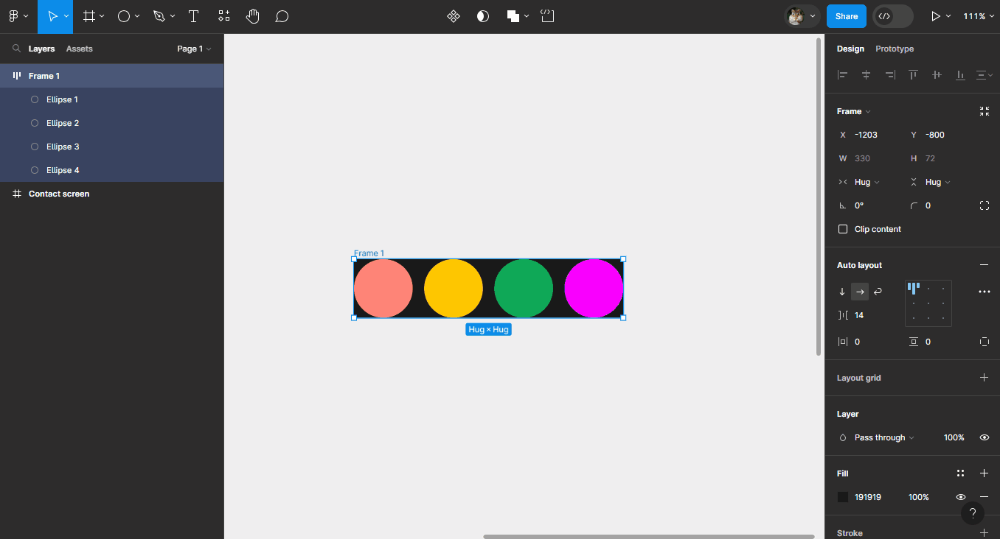
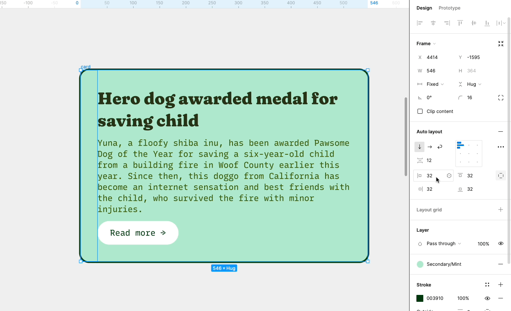
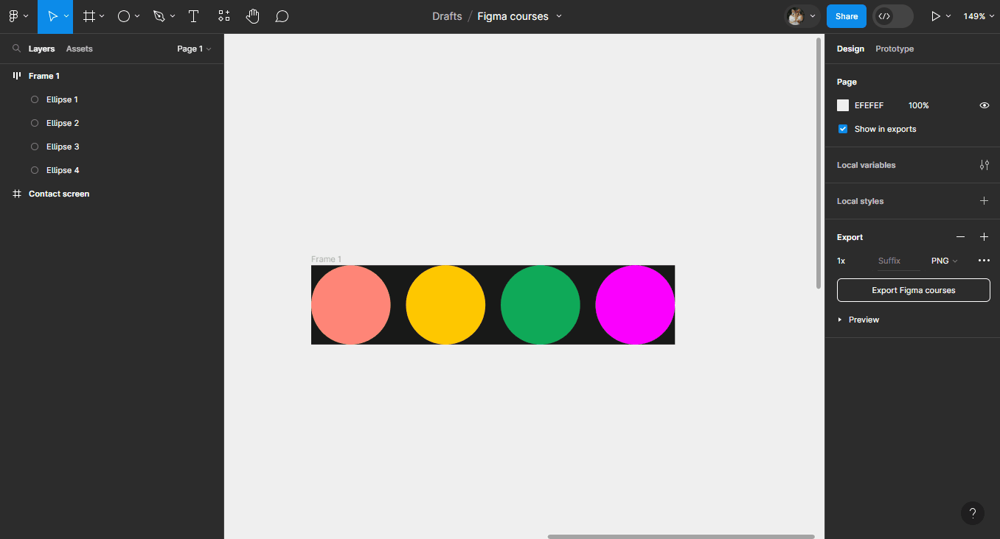

# Spacing

## Gap Between Items

Use the gap setting  (`Gap between items`) to manage the distance between elements within an `Autolayout`.

The `Gap` comes in two modes:
- **Specific gap**: specify the distance by entering a value into the field. You can also increase or decrease the field value using the directional arrows on the keyboard, or by clicking and dragging your cursor on .
- **Automatic gap**: enter the value "**Auto**", or select it from the dropdown menu, to have the elements spaced as far apart as possible.

> **Note:** You can configure the gap between elements if the direction is `Horizontal`  or `Vertical` . If the direction is set to `Wrap`, it is possible to manage both horizontal and vertical gaps simultaneously.

::: details Demo 🎥

:::

**Exercise:** Try setting the `Gap` to automatic on your `Autolayout` then expand your `Frame`!

::: details Tutorial 🎥

:::

## Padding

Padding in an `Autolayout` controls the empty space between the content of the `Frame` (its elements) and its border. You can set padding uniformly, vertically, horizontally, or apply different values for top, bottom, left, and right.

::: details Demo 🎥

:::

You can adjust the padding in the `Design panel` on the right: by default, the padding options are separated between vertical (top and bottom) and horizontal (right and left).

> **Note:** To set padding on each side individually:
- click on 
- Fields for `top`, `right`, `bottom`, and `left` will appear!
- Use these fields to modify the paddings
- Hold the <kbd>Ctrl</kbd> key and click on one of the fields, you can now enter the paddings for top, right, bottom, and left using the format `1,2,3,4`.

::: details Demo 🎥

:::

**Exercise:** Modify the paddings! Try out the different techniques to modify the padding of your `Autolayout`.

::: details Tutorial 🎥

:::