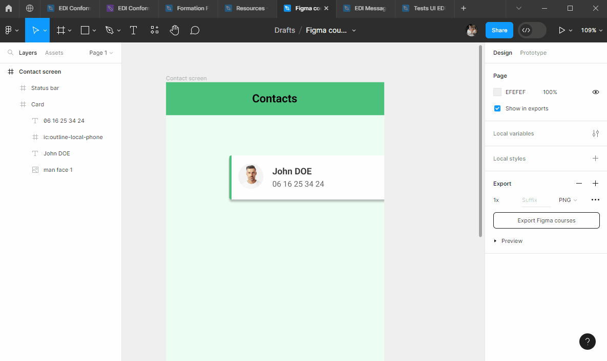

# Positioning

::: tip 🎯 Goal: Position elements precisely pixel by pixel!

:::

## Alignments

### Aligning an Element within a Container

As we've seen before, Figma allows you to align (left, right, top, bottom, center) an element within its container (`Frame`, `Group`, `Section`):
- directly on the canvas (using Figma's visual guides)
- using the alignment buttons at the top right of the `Design panel`

::: details Tutorial 🎥

:::

### Aligning Multiple Elements

To align elements relative to one another, you can:
- move the elements one by one using Figma's visual guides
- select them all, then use the alignment buttons at the top right of the `Design panel`

::: tip Deep Selection & Multi-Selection 💡

To select an element within another (group, frame):
- either double-click until you reach the element
- or hold down the <kbd>Ctrl</kbd> key and click on the element

To select multiple elements at once: hold down <kbd>Shift</kbd> and click on the elements one by one

Use <kbd>Ctrl</kbd> + <kbd>Shift</kbd> to perform multi-selection in depth!

:::

**Exercise:** Align elements in your `Contact Card`
- Align your `Name` and `Number` texts (justified to the left)
- Group them in a `Frame` (<kbd>Ctrl</kbd> + <kbd>Alt</kbd> + <kbd>G</kbd>) and rename this `Frame` to `Contact info`
- Horizontally center your three contact elements (photo, contact info, and icon)

::: details Tutorial 🎥

:::

## Spacing
The last step in correctly positioning your elements is to apply the right spacing around and relative to the others!

For an ordered, coherent, and clean design, it's important to have identical/proportional and precise spacing. Therefore, interface designers often position interface elements to the exact pixel!

::: tip Move an Element to the Exact Pixel! 💡
To move an element pixel by pixel in Figma: select your element and use the arrow keys on the keyboard!

To move an element a **certain number** of pixels at once (called `Nudge`), hold down <kbd>Shift</kbd> and control the movement with the directional arrows <kbd>↑</kbd>, <kbd>↓</kbd>, <kbd>→</kbd>, <kbd>←</kbd>!

By default, this distance is 10 pixels, and you can change this gap in Figma's options `File` > `Preferences` > `Nudge amount...`

:::

>**Note:** If you zoom in all the way (<kbd>Ctrl</kbd> + <kbd>Mouse Wheel</kbd>) on the canvas, you'll eventually see the pixels of your design! This is an additional aid for a pixel-perfect design!

::: tip Viewing Spacing 💡
Use <kbd>Alt</kbd> to view the spacing between the element and the screen edges.
:::

**Exercise:** Position your `Contact Card` to the exact pixel!
- if you haven't done it yet, change the `Nudge amount` of your project (`File` > `Preferences` > `Nudge amount...`) by entering the value 8
- in the contact screen, position your contact card to the left edge of the screen just below your status bar
- move it 16 pixels to the right with <kbd>Shift</kbd> + <kbd>→</kbd> and then 16 pixels down (<kbd>Shift</kbd> + <kbd>↓</kbd>)
- then, extend the `Contact Frame` so that it reaches 16 pixels from the right edge of the screen (you can do this by expanding the `Frame` to the edge of the screen and then subtracting the desired number of pixels from the width `Width`)

::: details Tutorial 🎥

:::

**Exercise:** Align Multiple Contacts
- Duplicate your `Contact Card` twice

::: tip Duplicate an Element
To duplicate an element in Figma, you can select your element and then:
- use the keyboard shortcuts <kbd>Ctrl</kbd> + <kbd>C</kbd> to copy, then <kbd>Ctrl</kbd> + <kbd>V</kbd> to paste
- use the shortcut <kbd>Ctrl</kbd> + <kbd>D</kbd> to copy/paste directly
- hold <kbd>Alt</kbd>, click on your element, and then drag your cursor outside of it
- use right-click (copy then paste)
  :::

- Vertically align your `Contact Cards` (justified to the left)
- Space your `Contact Cards` 16 pixels apart from each other

::: details Tutorial 🎥

:::

## Grids

Grids are layout tools that facilitate the positioning of the various elements that make up our pages.
If you are designing for the web, they can be particularly useful for creating `responsive` designs but are also useful for tablet or mobile formats.

**Grids can only be applied to `frames`**

There are 3 elements associated with `layout grids`: grids, columns, and rows.

To create a `layout grid`, select a frame and then access the `layout grid` section from the `design panel`.

You can create 3 different layouts:
- **grids** (static, independent of the frame size)
- **columns**
- **rows**

There are 4 types of column and row alignments:

- Stretch (the column sizes automatically adjust to fit the frame)
- Center
- Left
- Right

You can adjust the sizes of columns and rows, as well as the `gutter` and `margin`.
A `gutter` refers to the space between lines or columns.
The `margin` refers to the space at the ends of lines or columns.

<!--INSERT SCHEMA SCREEN OF THE TRAINING SCREEN WITH GRID INDICATIONS-->