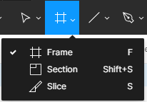
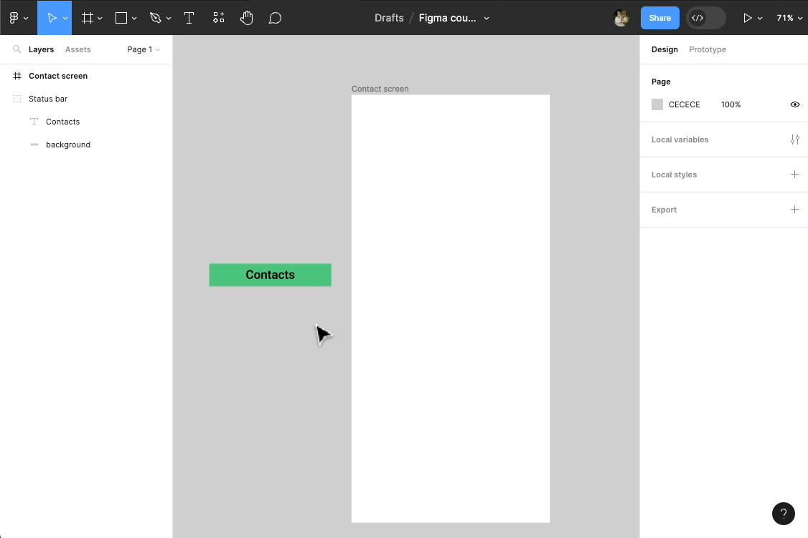
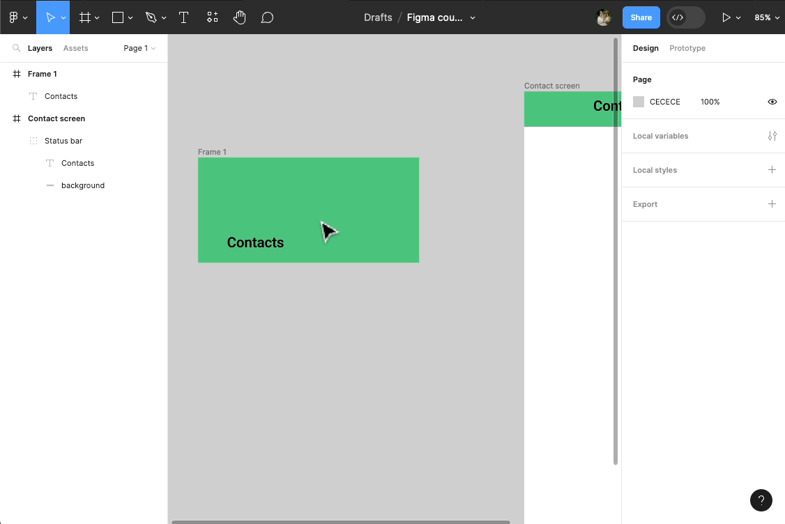
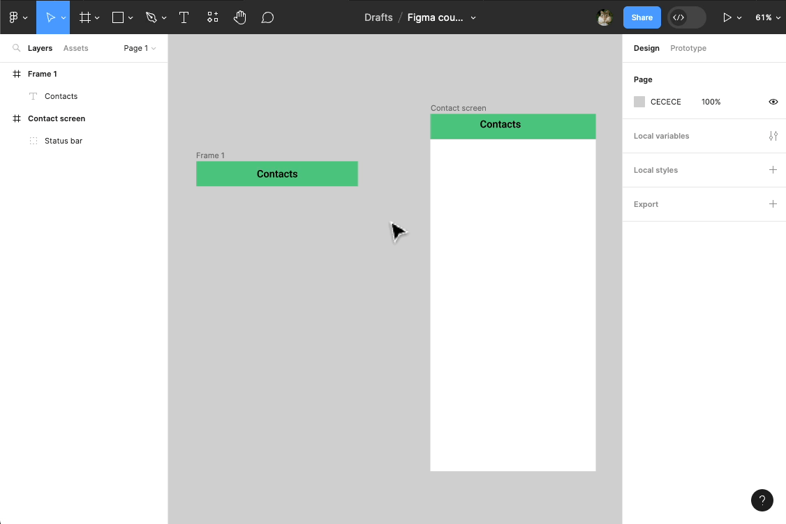
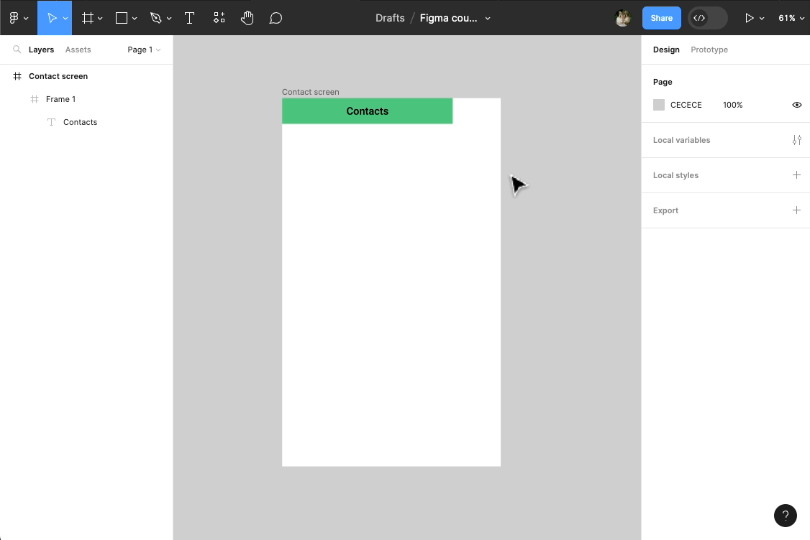

# Frames

To create screens in Figma, we use what are called `Frames`. Frames are containers where we place our user interface elements.

::: tip 🎯 Goal: create the Contacts screen

:::

You can create a frame by clicking on the `Frame` tool in the `Toolbar` (keyboard shortcut <kbd>F</kbd>).

In the `Design panel`, select a phone screen (e.g., iPhone 14)

::: details Tutorial 🎥

:::

> **Note:** A phone screen is a frame with the resolution of the model (height and width in pixels): 

::: tip Navigating the canvas 💡

Is your canvas getting more and more filled? Don't panic!!!

You can navigate using the `Hand tool`  or by holding <kbd>Space</kbd> (space bar on the keyboard)

Use zoom to take a step back and better see your work:
- <kbd>Ctrl</kbd> + Mouse Wheel
- Touchpad (laptop)
  :::

We can now place our `Status bar` inside our frame by dragging it over.

Once inside, you can resize and position the `Status bar` at the top of the screen.

> **Help:** You can use Figma's alignment aids to align the `Status bar` at the top left of the screen, then resize it directly in the canvas to fit the width.

::: details Tutorial 🎥

:::

Here we observe a behavior that is not convenient for us: we would like the text to stay centered with respect to the rectangle. However, we notice that the text container has increased in size proportionally with the rectangle.

::: tip Group VS Frames 🤔
`Groups` are not flexible (they have very few properties), and the elements inside are dependent on resizing. In contrast, `Frames` (kind of advanced groups) provide more control: for example, they offer various types of constraints for the elements they contain.

Use a:
- `Group` - for short-term design (user testing, wireframes) that doesn't need a flexible structure (resizings)

- `Frame` - for long-term design (maintenance, evolutions) for more flexibility (responsive elements)
  :::

To better grasp the difference between `Groups` and `Frames`, recreate a `Status bar` using a frame:

::: details Tutorial 🎥

:::

> **Note:** With a frame, you no longer need a rectangle to put a colored background on our `Status bar`. Just change the fill color of the frame.

When we select an element in a frame, we notice that a new property `Constraints` appears in the `Design panel` on the right.

These are the constraints of the element in relation to its container (the frame).

In a `Frame`, by default, elements (for example: our text) have a constraint _top_ and _left_: that is, if we resize our frame, the inner elements will always maintain a fixed distance from the _top_ and _left_ borders of the frame.

Please:
- Center the text within the frame.
- Apply to it a constraint centered in width and height
- Try to resize the frame 🙂

::: details Tutorial 🎥

:::

`Frames` simplify our life, especially when we want to design responsive screens (content that adapts to different screen sizes).

Let's create a responsive screen using the elements already present:
- Select the old `Status bar` (text + rectangle group) then delete it by pressing the <kbd>Back</kbd> key on the keyboard
- Replace it with the new `Status bar` (frame), positioning it inside the screen (frame `Contact screen`)
- Try to resize the phone screen

::: details Tutorial 🎥

:::

This time we want the new `Status bar` to adapt in width when we resize the screen: this is possible because we have used frames to build our elements!!!

To do this:
- Press <kbd>Ctrl</kbd> + <kbd>Z</kbd> to undo the screen resizing
- Select the `Status bar` then apply to it a `Scale` constraint in width
- Try to resize the screen 😉

::: details Tutorial 🎥

:::

> **Note:** It is therefore possible to create Frames, within Frames, within Frames ... 👍

And to finish, remember to properly rename the Frame (`Status bar`):

::: details Tutorial 🎥

:::