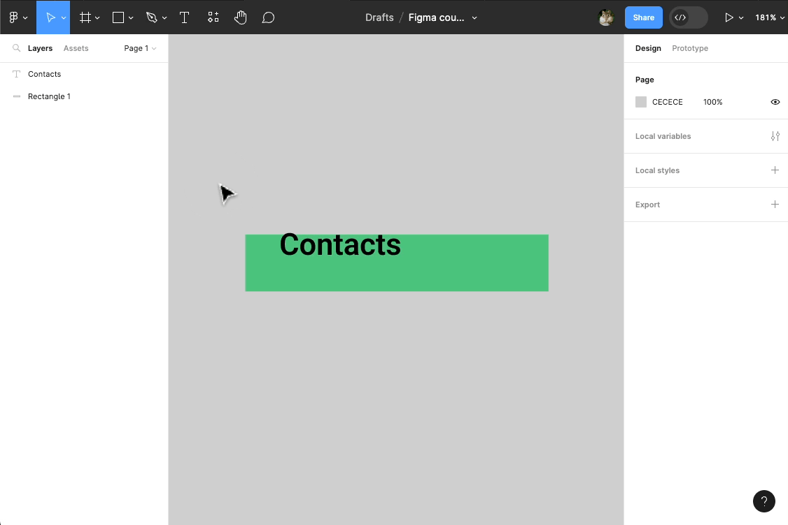
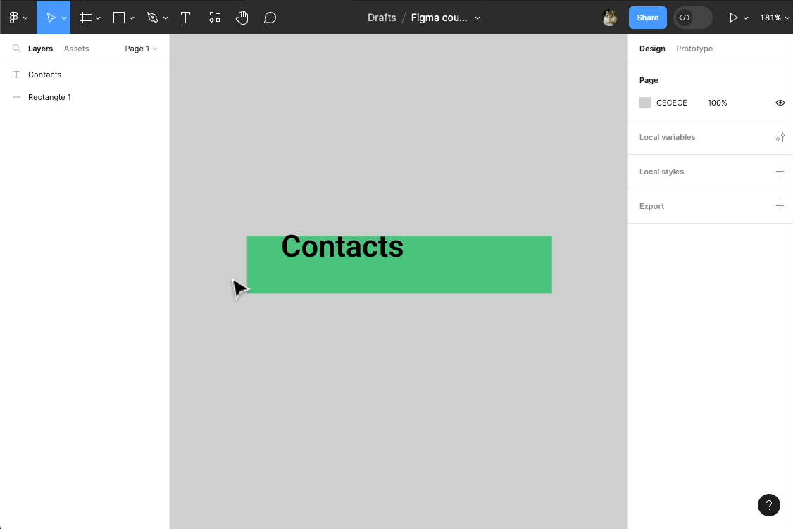

# Groups

To create more complex interface elements, it is possible to group elements together.

For this example, we will create a status bar (which can be found in many mobile apps).

::: tip 🎯 Goal: create the Status bar

:::

To do this, start by positioning the text in the middle of the rectangle.

## Layer Stacking Order
Because the rectangle was created last, it appears above the text in the `Layers Panel` on the left. Thus, you need to change the stacking order of the layers.

There are several ways to do this:
- Right-click on the text, then select the _Bring to front_ option.
- Right-click on the rectangle, then select the _Send to back_ option.

::: details Tutorial 🎥

:::

- In the `Layers Panel` on the left, drag the text above the rectangle or vice versa.

::: details Tutorial 🎥

:::

## Positioning
To center elements relative to one another, there are several solutions:
- Select all elements (with <kbd>Shift</kbd> OR by drawing a selection rectangle around them with the selection tool ) and then use the alignment buttons in the `Design Panel` at the top left 

::: details Tutorial 🎥

:::

- Directly select the text in the center of the rectangle with the visual aids in Figma

::: details Tutorial 🎥

:::

Once positioned, select the text and the rectangle (for example with <kbd>Shift</kbd>) and then press <kbd>Ctrl</kbd> + <kbd>G</kbd> to group.

> **Note:** You can see that a new element (group layer type) has appeared in the `Layers Panel` on the left. It contains the text and the rectangle.

Rename the layers for better organization of your design.

::: details Tutorial 🎥

:::

You now have a `Status bar` element ready for use in your future screens! 👏