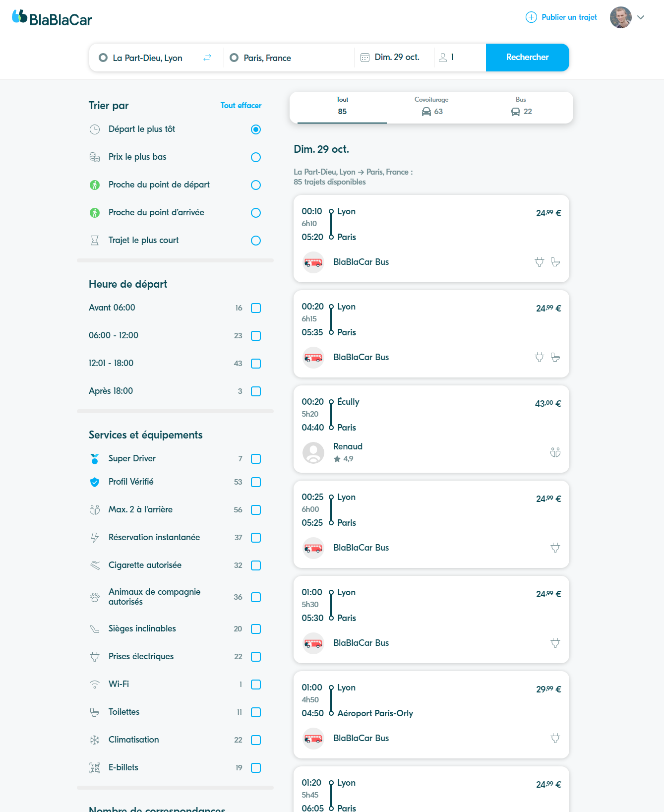

# Replicate an Existing Design

::: tip 🎯 Objective: Construct this view on Figma!

:::

Now that we've experimented with Figma's different tools on a simple example, let's try creating a complete view from a real-world design.

The objective is to guide you less than in the theoretical part, but we still propose breaking down the overall task into smaller ones, otherwise it can be complex to know where to start!

Don't panic if you don't have time to finish the screen; it's likely too ambitious a goal for the time allocated for this training session.

Having more material allows faster learners to go further and also to continue practicing outside this training if you wish.

If you continue the exercise later, you'll always be able to contact us for a review of your Figma :)

::: warning

When replicating a design from a screenshot, the result clearly can't be perfectly identical.

For instance, you can use different fonts and icons—that's not what's important.

:::

::: tip Solution

[An example solution is available here](https://www.figma.com/file/uUvHGlJITQbQQnn4zMxJku/Blablacar?type=design&node-id=0%3A1&mode=design&t=ebOpGpn3qxmYY7BI-1).

Try tackling it yourself before looking at the solution!

( There are multiple pages in the Figma ;) )

:::