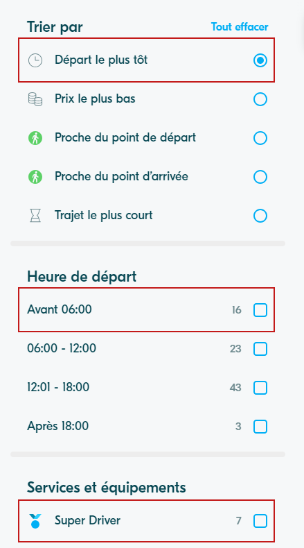

# Filter List

::: tip 🎯 Objective: Create the filter list

:::

## Creating the `Filter Cell` Component
Here we have a typical issue that arises when creating cells: we have several elements that are similar but not totally identical.

The question then arises for creating these variations in the component: variants or properties?

I don't think there is a definite answer. It could also be a mix of the two. When making this choice, keep in mind:

- **Ease of use** of the component.
- **Possibility of evolution** of the component.
- **Readability of the Figma**: is it easy to understand the customization possibilities of this component?
- **Consistency of the component**: sometimes we want to deliberately prohibit certain combinations of parameters because it would not make sense for a given component.

Taking this into consideration, try to create your cell component. Feel free to debate among yourselves about the different possibilities ;)

::: tip 💡 Icon Management

The best way to manage icons is to make a component out of each icon and put all these components in the same frame.

This will allow you to smoothly use instance swap among these icons in the component properties.
:::

## Creating the List
Once the filter cell component is created, you've done most of the work for creating the list.

It remains to create headers and separators and then integrate everything into autolayouts.