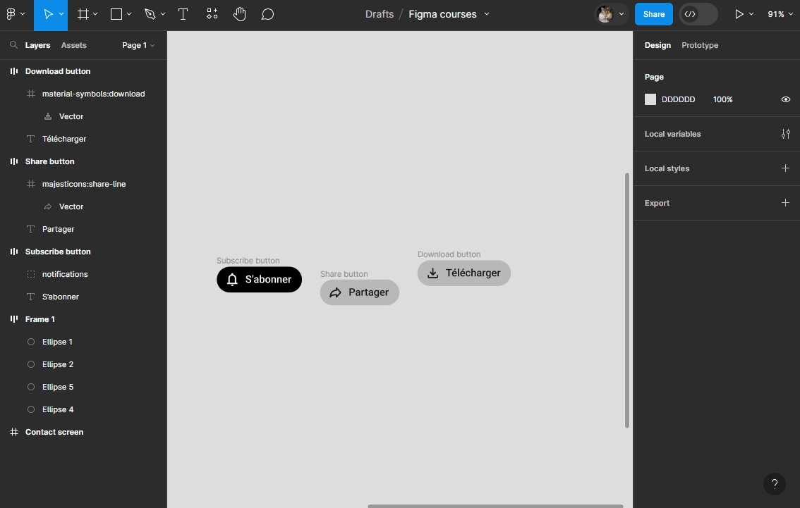

# Redimensionnements

## Hug contents
Une des plus puissantes fonctionnalités de l'autolayout est d'adapter les dimensions de sa `Frame` en fonction de son contenu !

Vous l'avez peut être déjà remarqué, lorsque vous ajoutez un élément dans une `Frame` avec `Autolayout`, sa taille s'adapte ! C'est parce que par défaut, ses propriétés `Horizontal resizing` et `Vertical resizing` sont réglées sur `Hug contents`.

::: details Démo 🎥

:::

**Exercice :** Créer le bouton `S'abonner` de youtube !

::: tip 🎯 Objectif : Bouton intelligent
Un cas pratique de l'autolayout, vous allez créé un bouton qui s'adapte à la taille de son texte

:::
- Créer un texte "S'abonner"
- Sélectionner votre texte et faites <kbd>Shift</kbd> + <kbd>A</kbd> pour créer un autolayout à partir de celui-ci

>**Remarque :** Votre texte est maintenant contenu dans une `Frame`avec `Autolayout`
- Modifier le texte et la `Frame` comme ceci :
    - couleur du texte : blanc  
    - taille du texte : 16 pixels
    - hauteur du texte : 24 pixels
    - couleur de fond de la `Frame` : noir
    - `Gap`de l'autolayout : 8 pixels
    - `Padding` de l'autolayout (haut, droite, bas, gauche) : 8, 16, 8, 12
    - Changer l'arrondis des angles (`Corner radius`) de la `Frame` : au moins 20 pixels
- Vérifiez que la propriété `Horizontal resizing` de la `Frame` est bien sur `Hug contents`
- Ajouter une icône type "bell" (cloche) dans la `Frame`et la positionner avant le texte
- Essayer de modifier le texte et remarquer que la taille de la `Frame` s'adapte

::: details Démo 🎥

:::

## Largeur et hauteur fixes
Si vous saisissez une valeur fixe (`Horizontal resizing` et/ou `Vertical resizing`), la taille de la de la `Frame` ne s'adaptera plus au contenu.

## Fill container

Si `Horizontal resizing` et `Vertical resizing` sont fixes, vous pouvez cependant adapter la taille des éléments à l'interieur de la `Frame` !

Grâce à l'option `Fill container`, l'élément va remplir tout l'espace disponible à l'intérieur de la `Frame` !

>**Remarque :** Il faut ici sélectionner l'élément à l'intérieur de la `Frame` pour lui appliquer l'option `Fill container` dans `Horizontal resizing`. Pour mémo : double-cliquez jusqu'à atteindre l'élément désiré, ou faire <kbd>Ctrl</kbd> + <kbd>Clique</kbd>, pour le sélectionner.

**Exercice :** Essayez l'option Fill container
- Créez deux autres boutons (Partager et Télécharger) à partir du premier
- Sélectionnez les trois boutons puis faites <kbd>Shift</kbd> + <kbd>A</kbd> pour créer un autolayout
- Ajoutez une valeur d'espacement entre les éléments et autour des éléments (`Gap`, `Padding`)
- Ajoutez une couleur de fond à votre `Frame``Autolayout` pour mieux la voir et comprendre le comportement
- Aggrandissez votre `Frame` (celle qui contient vos boutons) en largeur (valeur fixe `Horizontal resizing`)
- Sélectionnez un bouton puis lui appliquer l'option `Fill container`
- Essayez de redimensionner la `Frame`en largeur et observer le bouton (sa taille s'adapte en largeur)

::: details Tuto 🎥

:::

- Appliquez `Fill container` à tous les boutons de la `Frame` puis essayer de la redimensionner en largeur
- Essayer de changer sa direction (vertical/horizontal)

::: details Démo 🎥

:::

## Dimensions minimum et maximum

Il est possible de paramétrer un maximum et/ou un minimum pour la largeur et la hauteur d'une `Frame` avec `Autolayout`. Pour se faire :
- ouvrir la liste déroulante de la largeur (`Width`) pour trouver les options  `Add min width` et  `Add max width`
- ouvrir la liste déroulante de la hauteur (`Height`) pour trouver les options  `Add min height` et  `Add max height`

**Exercice :** Largeur maximum et minimum !
- Ajoutez une largeur maximum (250px) et une largeur minimum (170px) pour le bouton `S'abonner`
- Essayez de redimensionner le bouton au delà de ces dimensions

::: details Tuto 🎥

:::

